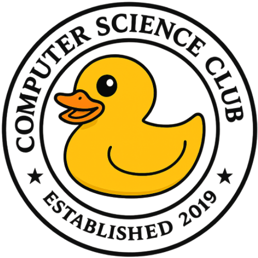

# Mt. SAC Computer Science Club Website



[](https://nextjs.org)
[](https://www.typescriptlang.org)
[](https://tailwindcss.com)

This is the official website for the Mt. SAC Computer Science Club, built with Next.js and TailwindCSS. Our website serves as a central hub for club information, events, and resources for our members.

## 🎯 Project Overview

The first version of the CS Club website fulfilled its purpose but lacked structure, scalability, and visual consistency across pages. Version 2 was built to resolve these limitations by adopting a more thoughtful design system, mobile-first responsiveness, and a simplified codebase using modern tooling (Next.js 14, TailwindCSS, Lucide). This iteration focuses on accessibility, cohesive branding, and smoother UX across both static content and dynamic event functionality. It's a foundation not just for aesthetics, but for maintainability and contribution going forward.

## 🚀 Features

- **Modern Design**: Built with a clean, responsive interface using TailwindCSS
- **Dynamic Events**: Showcase of upcoming and past club events with RSVP functionality
- **Team Showcase**: Profiles of our officers, advisors, and team members
- **Project Portfolio**: Gallery of club projects and achievements
- **Easy Navigation**: Intuitive layout with quick access to important information
- **Responsive**: Fully functional across all device sizes

## 🛠️ Tech Stack

- **Framework**: [Next.js 14](https://nextjs.org)
- **Styling**: [TailwindCSS](https://tailwindcss.com)
- **Icons**: [Lucide Icons](https://lucide.dev)
- **Deployment**: [Vercel](https://vercel.com)

## 🏗️ Project Structure

```
mtsaccs-v2/
├── app/                    # Next.js app directory
│   ├── components/         # Reusable UI components
│   ├── events/            # Events page
│   ├── team/              # Team page
│   ├── projects/          # Projects page
│   ├── join-us/           # Membership page
│   └── page.tsx           # Homepage
├── public/                # Static assets
│   └── static/            # Images and media
└── styles/                # Global styles
```

## 🚀 Getting Started

1. Clone the repository:
```bash
git clone https://github.com/bgar324/mtsaccs-v2.git
cd mtsaccs-v2
```

2. Install dependencies:
```bash
npm install
# or
yarn install
```

3. Run the development server:
```bash
npm run dev
# or
yarn dev
```

4. Open [http://localhost:3000](http://localhost:3000) in your browser

## 🤝 Contributing

We welcome contributions from our members! If you'd like to improve the website:

1. Fork the repository
2. Create your feature branch (`git checkout -b feature/AmazingFeature`)
3. Commit your changes (`git commit -m 'Add some AmazingFeature'`)
4. Push to the branch (`git push origin feature/AmazingFeature`)
5. Open a Pull Request

## 📝 License

This project is maintained by the Mt. SAC Computer Science Club. All rights reserved.

## 🔗 Links

- [Club Discord](https://discord.com/invite/sWpjfHVuuT)
- [Club Instagram](https://www.instagram.com/cs.mtsac/)
- [Club GitHub](https://github.com/mtsac-cs)

## 📧 Contact

For questions or feedback about the website, please use our [feedback form](https://docs.google.com/forms/d/e/1FAIpQLSeacERWRiAnTlXoFRgdWw6ObGU5aqV79HIT5Od5um5mQwm1vg/viewform) or join our [Discord server](https://discord.com/invite/sWpjfHVuuT).